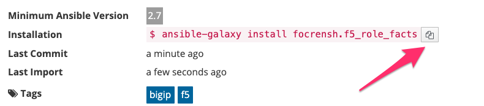
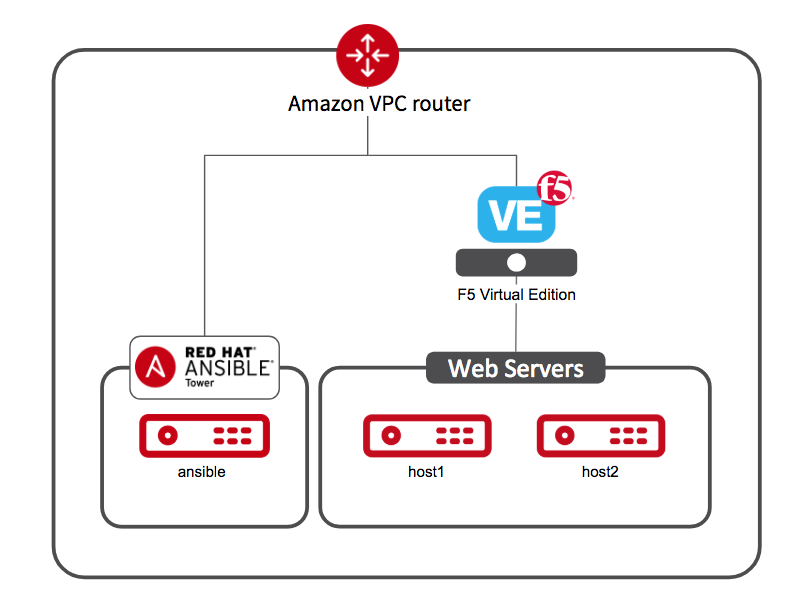
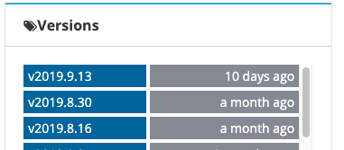
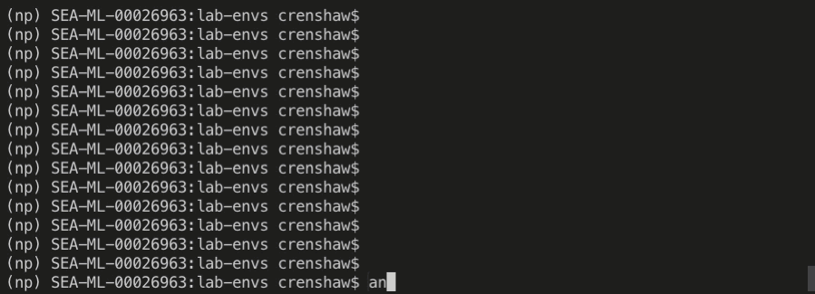
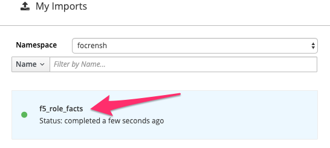

Build a Role Lab
================

.. contents:: :depth: 3

.. toctree::
   :maxdepth: 2
   :caption: Examples:

   examples/ex1_modules
   examples/ex2_declarative

Lab Environment
---------------

You will get login information at the beginning of class. Verify you can ssh to your lab ansible host on the primary page using your student number. Below is a diagram of the lab environment that you will be working in.

|labenv|

.. NOTE:: You can retrieve the IP of your F5 BIG-IP instance in /home/studentX/networking_workshop/lab_inventory/hosts file. Access the GUI in  the browser with https://X.X.X.X:8443/

What is an Ansible Role
-----------------------

An Ansible role is an independent component which allows reuse of common configuration objects. You can use an Ansible Role by adding to a new or existing playbook. An Ansible role is a set of tasks to configure a device to a desired state. Roles are defined using YAML files with a predefined directory structure. This predefined structure allows a roles behavior to be predictable when reusing them. We will go over this directory structure later in the lab

For complete documentation refer to https://docs.ansible.com/ansible/latest/user_guide/playbooks_reuse_roles.html

Why use an Ansible Role
-----------------------

Roles allow you to group common tasks or actions together to create a desired end state. By adding these tasks to a role, you are allowing the reference of a single object, the role, to add similar functionality to any playbook.

- Reduce rework (common functionality is shared)
- Improve reliability (lower number of 1-off playbooks)
- Single Source-of-Truth for the role
- Makes playbooks easier to read

Role Structure
--------------

Below is the starting structure of a role. A brief description of each directory/files purpose is listed below.

.. code:: shell

   role-name
     ├── README.md
     ├── defaults
     │   └── main.yml
     ├── files
     ├── handlers
     │   └── main.yml
     ├── meta
     │   └── main.yml
     ├── tasks
     │   └── main.yml
     ├── templates
     ├── tests
     │   ├── inventory
     │   └── test.yml
     └── vars
         └── main.yml

- Most directorys will have a ``main.yml``. The role will check this file by default for instructions.
- The tasks directory is the core of the role. It is the tasks or actions that the role will take. Typically this contains modules.
- handlers - contains handlers, which may be used by this role or even anywhere outside this role.
- defaults - default variables for the role (see Using Variables for more information).
- vars - other variables for the role (see Using Variables for more information). These take precedence of **defaults**.
- files - contains files which can be deployed via this role.
- templates - contains templates which can be deployed via this role. (inlcuding jinja2)
- tests - good for automated testing of role, but will not be covered today
- README (markdown) is important for adding descriptions and context to your role for others to use
- meta - contains information that ansible-galaxy uses to define the role (Author, dependencies, etc)

This structure may seem overwhelming but there is a helpful command, which we will cover later, for getting started that will create the folder/file structure for you.

What is Ansible Galaxy
----------------------

Ansible Galaxy refers to the Galaxy portal/hub where users can share roles, and to a command line tool for installing, creating, and managing roles. It it open to the community, anyone can publish and consume roles form galaxy.

Example roles in Galaxy
~~~~~~~~~~~~~~~~~~~~~~~

- Installing NGINX regardless of destination platform. (https://galaxy.ansible.com/nginxinc/nginx)

  - The Role can figure out if the platform is debian, ubuntu, or others and run the appropriate modules/commands to install nginx

- Group common tasks together to get a desired outcome

  - Role to deploy a global load balancing solution (Create WIDE-IP, POOL, Servers, etc): |f5gslbrole|
  - Role to troublshoot the BIG-IP (create tech support, backup and restore confguration etc): |f5backuprole|
  
Complete list of |f5ansibleroles| in galaxy

Installing Roles from Galaxy
~~~~~~~~~~~~~~~~~~~~~~~~~~~~

By default **ansible** will look for and install roles in 1 of 2 places:

   - Releative to current playbook being run: ``./roles`` (This is the one we will use for this guide)
   - Global for the ansible install: ``/etc/ansible/roles``

#. SSH to your lab ansible host with username studentX (where X is your student ID and password ansible)

#. Verify that you are in the home directory for your student number before we begin. Some of the variables we will use throughout this guide will assume this location.

   .. code:: shell

      [student1@ansible ~]$ pwd
      /home/student1

#. Now we are going to create a folder relative to our current working directory to store our ansible roles.

   .. code:: shell

      [student1@ansible ~]$ mkdir roles

#. Next we will update the ``ansible.cfg`` file for our current user to tell ansible to find and install roles in the new folder we created. Under the **[defaults]** section of the config file, right below **inventory**, we will add the line ``roles_path = ~/roles``.

   .. code:: shell

      [student1@ansible networking-workshop]$ vi ~/.ansible.cfg
      [defaults]
      stdout_callback = yaml
      connection = smart
      timeout = 60
      deprecation_warnings = False
      host_key_checking = False
      retry_files_enabled = False
      inventory = /home/student1/networking-workshop/lab_inventory/hosts
      roles_path = ~/roles
      [persistent_connection]
      connect_timeout = 60
      command_timeout = 60

#. Lets view what current roles are installed (it should be none). In the current terminal run ``ansible-galaxy list``.

   .. code:: shell

      [student1@ansible ~]$ ansible-galaxy list
      # /home/student1/roles

   For the current environment, it will list out the path for each defined location roles are stored. If there are any roles, they will show here. Once we install and create roles later on, you can run this command again to see them. Right now it should list the location you just defined in the ``ansible.cfg`` file with nothing under it.

#. Now that our environment is ready to use roles, lets install one from **Ansible Galaxy**. Navigate to |f5rolefacts| to view the role that we are going to install. Spend some time looking at the **Read Me** page for the role as this is generated from the README file in the role structure. You can also click the |ghlink| in the top right corner to view the role itself hosted on github. The folder structure will be the same as the outline we went over at the beginning.

   The **Details** page of this role will provide an installation snippet like below. Copy this command using the **copy** icon and paste it into your ssh terminal window. The Role should install and the output should look similar to the shell output below.

   |role-install|

   Output:

   .. code:: shell

      [student1@ansible ~]$ ansible-galaxy install focrensh.f5_role_facts
        - downloading role 'f5_role_facts', owned by focrensh
        - downloading role from https://github.com/focrensh/f5-role-facts/archive/master.tar.gz
        - extracting focrensh.f5_role_facts to /home/student1/roles/focrensh.f5_role_facts
        - focrensh.f5_role_facts (master) was installed successfully

   .. NOTE:: Here are some additional commonly used commands when installing roles. You can use these depending on if you are testing a role or using specific versions. By default a Galaxy will install the newest tagged version of a role.

      - ``ansible-galaxy install focrensh.f5_role_facts,v0.9.0`` | Install version v0.9.0 of the role
      - ``ansible-galaxy install focrensh.f5_role_facts,v0.9.0 --force`` | Install the role even if another verison already exists
      - ``ansible-galaxy install focrensh.f5_role_facts,master`` | Install the master branch of the role (even if its not tagged with a version)
      - ``ansible-galaxy remove focrensh.f5_role_facts`` | Remove role from the environment
      - ``ansible-galaxy info focrensh.f5_role_facts`` | View role meta information in CLI

#. Run the ``ansible-galaxy list`` command again to see that the new role is installed.

   .. code:: shell

      [student1@ansible ~]$ ansible-galaxy list
      # /home/student1/roles
      - focrensh.f5_role_facts, master

#. Spend some time looking through the role folders/files in ``./roles/focrensh.f5_role_facts``. You will see many of the files mentioned before. The primary file to look at would be the ``tasks/main.yml`` as it has the tasks that will take place when the role is called. You will see tasks in this file for gathering facts from the BIG-IP and then parsing the fact to return information about the BIG-IP such as MAC and VERSION. These should look the same as tasks that you would normally put inside a playbook directly.

   Primary files to take note of:

   - ``./roles/focrensh.f5_role_facts/tasks/main.yml`` Tasks for the role
   - ``./roles/focrensh.f5_role_facts/defaults/main.yml`` Default Vars for the role

Referencing a Role in a playbook
~~~~~~~~~~~~~~~~~~~~~~~~~~~~~~~~
Now that we have downloaded a role, lets look how to add it into an Ansible playbook. There is more than one way to reference a role within a playbook.

Classic (original way) - ansible will check each roles directory for tasks, handlers, vars, default, vars and other objects to add for the current host within the playbook. This is declared at the top of the play before ``tasks`` are defined. These objects will run before the tasks section begins.

.. code:: rst

   ---
   - hosts: f5
     roles:
      - super_awesome_role
      - betterer_role

Use Roles inline (2.4+). With this method, the role is treated more like a task itself within the playbook. It allows you to define when the role is referneced within the playbook. You will see that the example roles below are mentioned under the ``tasks`` section.

.. code:: yaml

   ---
   - hosts: f5
     tasks:
     - import_role:
         name: super_awesome_role
     - include_role:
         name: betterer_role
       

Using a role as a task has two different variants itself as shown above. Import and Include.

- Import (static) vs Include (dynamic)

  - **IMPORT**

    - Tasks are treated like part of the actual playbook.
    - If there is a syntax error in the role, the playbook will error immediatly.
    - Using ansible commands to view information about the playbook treats the role tasks as part of the playbook. Notice the ``--list-tasks``    option below shows the role tasks as part of the playbook. (`The Below output is an example, your are not expected to run this command`) 

      .. code:: shell

         ...
         tasks:
         - import_role:
               name: focrensh.f5_role_facts
         ...

         [student1@ansible ~]$ ansible-playbook role_playbook.yml --list-tasks
         
         playbook: role_playbook.yml
         
         play #1 (f5): Role Playbook	TAGS: []
           tasks:
             include_role	TAGS: []

  - **INCLUDE**

    - Include tasks are added when the playbook gets to those tasks on execution
    - You can use loops with the role
    - Include cannot reference/view objects within tasks such as (--list-tasks , --start-at-task, etc). The example below shows that the tasks    within the role we just referenced do not show up as part of the playbook when using Include. (`The Below output is an example, your are not expected to run this command`)

      .. code:: shell

         ...
         tasks:
         - include_role:
               name: focrensh.f5_role_facts
         ...

         [student1@ansible ~]$ ansible-playbook role_playbook.yml --list-tasks
         
         playbook: role_playbook.yml
         
           play #1 (f5): Role Playbook	TAGS: []
             tasks:
               focrensh.f5_role_facts : COLLECT BIG-IP FACTS	TAGS: []
               focrensh.f5_role_facts : DISPLAY Virtual Servers	TAGS: []
               focrensh.f5_role_facts : DISPLAY THE MAC ADDRESS	TAGS: []
               focrensh.f5_role_facts : DISPLAY THE VERSION	TAGS: []
             

Roles can use vars, tags, and conditionals just like other tasks. Below is an example of adding 2 variables to a role inline of the playbook.

   .. code:: YAML
   
      - hosts: f5
        tasks:
        - include_role:
           name: super_awesome_role
          vars:
           app_name: app123
           app_port: 8080

#. Lets create a playbook that will call the role we created in the previous section. Create a new playbook called ``role_playbook.yml`` and copy the yaml below into it. The name of the role matches that of the role that is now inside of the ``./roles`` directory. Notice that we are including the role into the playbook similar to tasks. When the ``include_role`` task triggers it will run the tasks within it as if they were then part of the playbook. Make sure you are back in the home directory of your user with ``cd ~``.

   .. code:: bash

      [student1@ansible ~]$ vi role_playbook.yml

   .. code:: yaml

      ---
      - name: Role Playbook
        hosts: f5
        connection: local
        gather_facts: no
      
        tasks:
      
        - include_role:
            name: focrensh.f5_role_facts

#. Run the play book with ``ansible-playbook role_playbook.yml``. The playbook>>role should output the VirtualServers (empty), MAC, and VERSION of the BIG-IP. (Your BIG-IP version may be different)

   .. code:: shell

      TASK [focrensh.f5_role_facts : DISPLAY Virtual Servers]
      ok: [f5] =>
        device_facts['virtual_servers']: []

      TASK [focrensh.f5_role_facts : DISPLAY THE MAC ADDRESS]
      ok: [f5] => {
          "device_facts['system_info']['base_mac_address']": "02:d1:fc:72:ba:aa"
      }
      TASK [focrensh.f5_role_facts : DISPLAY THE VERSION] 
      ok: [f5] => {
          "device_facts['system_info']['product_version']": "13.1.0.7"
      }

   The example facts that come back from this role could now be used to take action in other parts of the playbook. We have access to the variables without having to define each task to gather/parse them directly in the playbook. We can simply include the role into the playbook making it less difficult to understand the intent of the playbook and also allowing other playbooks to reuse this role.

Creating Roles
--------------

In this section we are going to create new roles versus just downloading them from Galaxy. Please use the links below to run through each example.

Role1 - Using Ansible modules
~~~~~~~~~~~~~~~~~~~~~~~~~~~~~

* :doc:`examples/ex1_modules`

Role2 - Using AS3 
~~~~~~~~~~~~~~~~~

* :doc:`examples/ex2_declarative`

Build your own F5 Ansible Role
------------------------------

Above are examples of how to develop a role and what a role with F5 BIG-IP would look like. Below are a few more use-cases for which a role can be developed. 

You are encouraged to pick one of the use cases below and or come up with your own F5 BIG-IP use case and build a role for it. If completed we will upload the role to Ansible Galaxy for the community to be able to consume.

- Create tech window by disabling all members in a pool and attaching a Maintenance irule.
- Set Base config settings such as NTP, DNS, Hostname, etc
- Parse virtual server information and display the default pool hence and pool members that belong to the pool

Take a look at |f5ansiblemodules| available and get started 

Upload a Role to Galaxy
-----------------------

- To upload a role to galaxy using the methods below, you must first upload the role to Github. Both the CLI and GUI method below will ask which namespace and repo to import the role from. 
- To add versions to your roles, using semantic versioning by using Git tags on your repo (v1.2.3)

Uploading Roles with CLI
~~~~~~~~~~~~~~~~~~~~~~~~

#. You must first authenticate to Galaxy using your github credentials. You can do this with password or github token. The below command will prompt you for your username and password. This will create a temporary access token between Galaxy and github.

   .. code:: shell

      ansible-galaxy login

#. Now you will want to import the role from your github repo with the following command:

   .. code:: shell

      ansible-galaxy import <namespace> <repo>

   |galaxycli|

   After the import, you can see the same status on the galaxy portal under https://galaxy.ansible.com/my-imports/ 

   |galaxyimported|

Uploading Roles with GUI
~~~~~~~~~~~~~~~~~~~~~~~~

#. Go to Ansible Galaxy website: https://galaxy.ansible.com

#. Login in the upper right corner and authenticate using the Github link presented. |ghlogo|

#. Onced logged in, click on **My Content** on the left hand menu. |mycontent|

#. Under the namespace github repo, select **+Add Content**. You will have two ways presented for importing content. In this example we are using github so we will select **Import Role from Github**.

#. You will now be presented with a list of repos from your github namespace to import into galaxy. Select the correct repo and then **ok** to import. If you are missing required meta/readme info, Galaxy will provide you with an error of what to update.

|galaxygui|

.. |galaxygui| image:: images/galaxygui.gif
.. |f5ansibleroles| raw:: html

   <a href="https://galaxy.ansible.com/f5devcentral" target="_blank">F5 Ansible Roles</a>
.. |f5backuprole| raw:: html

   <a href="https://galaxy.ansible.com/f5devcentral/backup_config" target="_blank">F5 Backup</a>
.. |f5gslbrole| raw:: html

   <a href="https://galaxy.ansible.com/f5devcentral/bigip_gslb" target="_blank">F5 GSLB</a> 
.. |f5rolefacts| raw:: html

   <a href="https://galaxy.ansible.com/focrensh/f5_role_facts" target="_blank">F5 Facts Role</a> 
.. |f5ansiblemodules| raw:: html

   <a href="https://docs.ansible.com/ansible/latest/modules/list_of_network_modules.html#f5" target="_blank">F5 Ansible Modules</a> 
